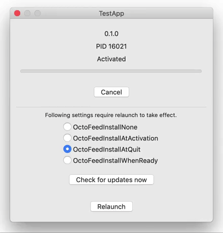

<h1 align="center">
    OctoFeed &middot; Update framework for macOS with GitHub integration 
    
</h1>

    

OctoFeed is an update framework for macOS applications. It is simple, it supports GitHub releases out of the box and is available under the MIT license.

## Why not Sparkle?

The [Sparkle](https://sparkle-project.org) framework is the go-to project for macOS developers that wish to update their apps. Sparkle is proven and is used in many MANY applications. If you are in doubt use Sparkle.

I created OctoFeed as an alternative to Sparkle. I list some of the reasons below:

- Sparkle is a large framework. This is great for many applications, but if you do not need many of the bells and whistles like binary deltas, etc. some of it feels like unnecessary bloat.

- If your scenario does not neatly fit within the scenarios supported by Sparkle then adapting it to your needs may be complicated. For example, the scenario that prompted me to start the OctoFeed project was that I wanted to perform updates at application launch ([more details](https://github.com/sparkle-project/Sparkle/issues/1289)).

- Sparkle includes its own UI (which it often insists on showing). In many cases this is not what you want.

- Sparkle does not support GitHub releases out of the box.

## Why OctoFeed?

OctoFeed is a simple UI-less update framework:

- Flexible. OctoFeed focuses on providing generic update functionality rather than enforcing specific update scenarios. It does provide convenient installation policies, but only if you choose to use them.

- Simple. If you need additional functionality, it is relatively easy to understand it and change it or extend it.
    - [Cloc](https://github.com/AlDanial/cloc) reports that it is 1393 LOC (as of Sep 26, 2018).

- GitHub releases out of the box. Easily extensible to support additional release sources.
    - Here is how releases are fetched from [GitHub](src/OctoFeed/OctoGitHubRelease.m).

- Bring your own UI. I know little about UI so you should not trust me anyway :)
